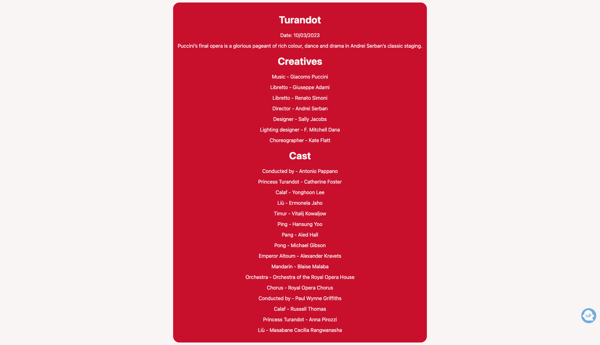

### Challenge Notes
- I completed the challenge using React and called the API using Fetch
- I ran into some issues seeing the API call at first because of CORS. So I downloaded a Google Chrome extension which bypassed the CORS error message.
- If I had more time I would consider implementing a server-side solution that can handle cross-origin resource sharing (CORS) issues. This solution would involve setting up a server with the necessary CORS headers, and then having the client application make API requests to the server instead of directly to the API. This will allow the app to bypass the CORS restrictions imposed by the browser.
- I had slight issues accessing the title and shortDescription object through object destructing so I had to set state to attribute instead. Ideally I would have like to just call one object and access the nested objects within it.
- Added some very basic styling to the project

### App Snippet

